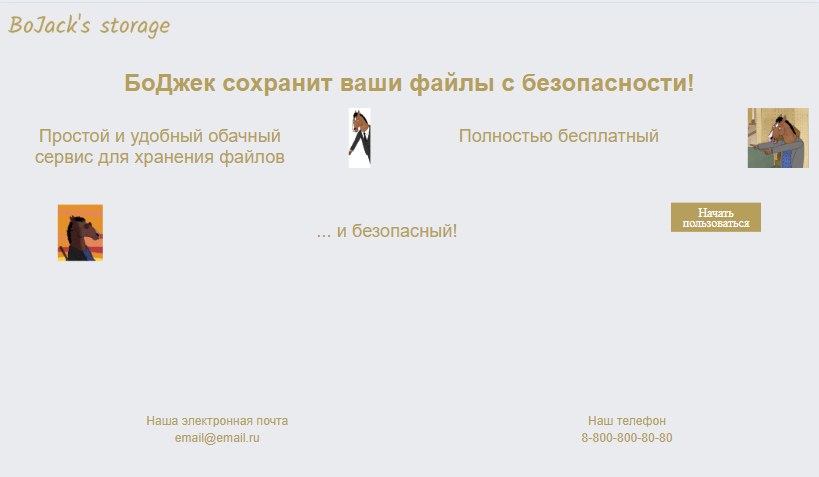
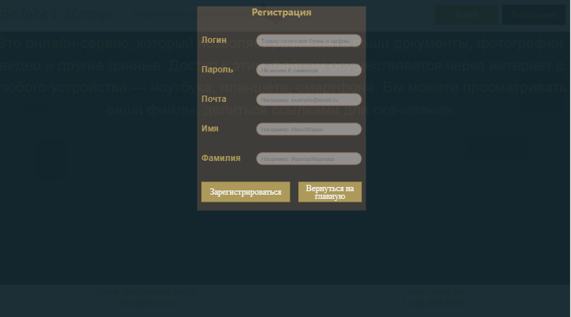
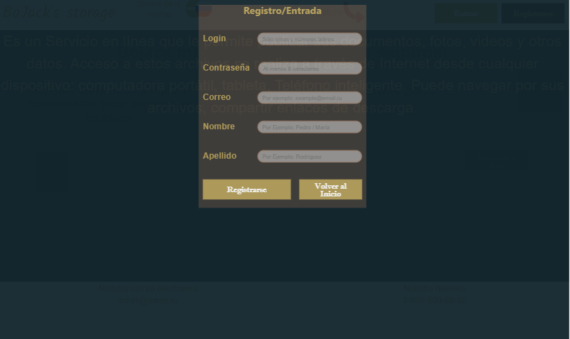
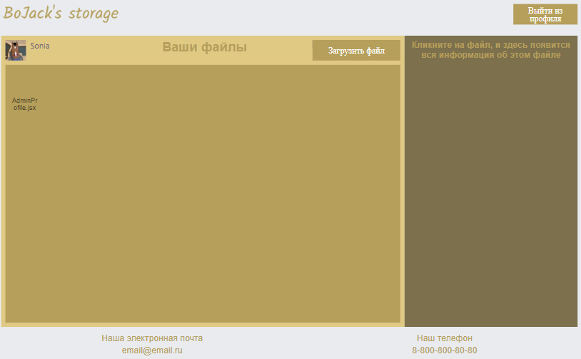
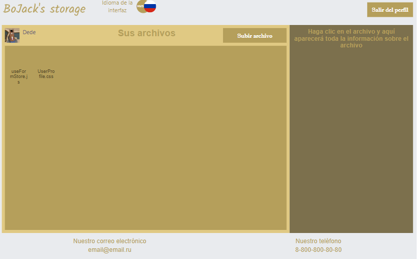
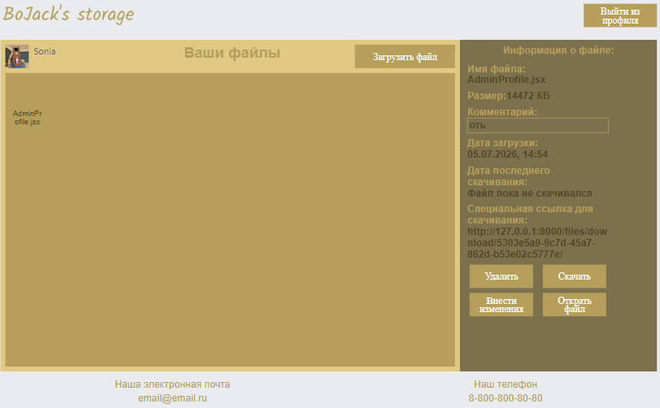
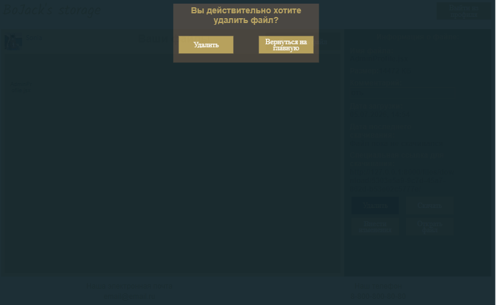
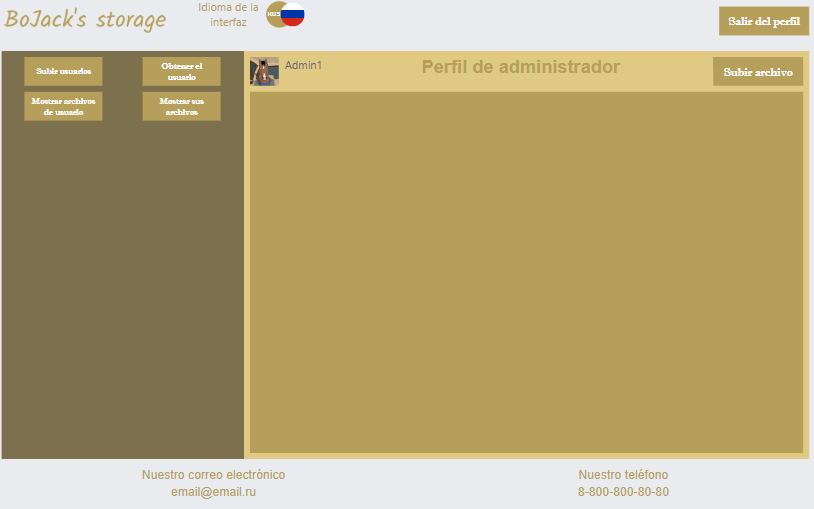
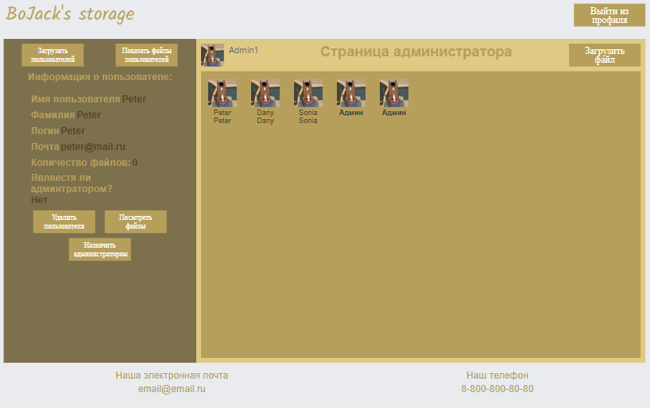

# Frontend — Облачное хранилище файлов

## 📖 Описание
Веб-приложение для загрузки и управления файлами в облаке. 
Поддерживает регистрацию, авторизацию, загрузку файлов, 
админ-панель для управления пользователями. 
Интерфейс является двуязычным: на русском и испанском языке.

## 🛠 Технологии
- React 19.2.6
- Zustand (стейт-менеджмент)
- React Router (роутинг)
- Fetch API (HTTP-клиент)
- Vite (сборка)
- Web Worker (асинхронная загрузка файлов)

## 🚀 Быстрый старт
```bash
yarn install
yarn dev
http://localhost:5173
```


## 📦 Сборка для продакшена

```bash
# Создание оптимизированной сборки
yarn build

# Предпросмотр продакшен-сборки локально
yarn preview

# Сборка будет в папке dist/
```

## 💡 Обоснование выбора технологий

### Почему React 19?
- Самая популярная библиотека для SPA с огромным сообществом
- Компонентный подход упрощает переиспользование кода
- Virtual DOM обеспечивает высокую производительность
- Версия 19 — актуальная на момент разработки (2026 г.)

### Почему Zustand вместо Redux?
- **Меньше бойлерплейта**: не нужно писать actions, reducers, dispatch
- **Простой API**: создание стора в 3 строки кода
- **Нет провайдеров**: не нужно оборачивать приложение в `<Provider>`
- **Лёгкий вес**: ~1 KB против ~10 KB у Redux Toolkit
- **Хуки вместо connect**: более идиоматичный React-код

### Почему Fetch API вместо Axios?
- Встроен в браузер — не нужна дополнительная зависимость
- Поддерживает все необходимые HTTP-методы
- Работает с промисами из коробки
- Для данного проекта не нужны продвинутые возможности Axios (интерсепторы, автоматическая трансформация JSON)

### Почему Web Worker для загрузки файлов?
- Большие файлы (100+ МБ) блокируют основной поток JavaScript
- Интерфейс "зависает", пользователь не может взаимодействовать с приложением
- Web Worker выполняет загрузку в отдельном потоке
- UI остаётся отзывчивым во время загрузки
- Это **ключевая техническая особенность** проекта, демонстрирующая понимание многопоточности в браузере

### Почему Vite вместо Webpack?
- В 10-100 раз быстрее холодный старт
- Нативная поддержка ES-модулей
- Мгновенный HMR (Hot Module Replacement)
- Простая конфигурация из коробки

### Почему JWT для аутентификации?
- Stateless — сервер не хранит сессии
- Подходит для REST API
- Токен можно хранить в localStorage
- Легко передавать между фронтендом и бэкендом


## 📸 Интерфейс приложения

### Главная страница (GreetingPage)


### Страница регистрации


### Страница регистрации на испанском языке


### Профиль пользователя со списком файлов


### Профиль пользователя на испанском


### Информация о файле


### Удаление файла


### Админ-панель


### Админ-панель на испанском языке


### Информация о пользователе



## ⚙️ Переменные окружения

Используется файл `.env` в корне проекта на основе `.env.local`:

```bash
VITE_API_URL=http://localhost:8000/
```

## Список API эндпоинтов, с которыми работает фронт


## 🔌 API эндпоинты

Фронтенд взаимодействует со следующими эндпоинтами бэкенда:

### Аутентификация
| Метод | Эндпоинт | Описание |
|-------|----------|----------|
| POST | `auth/signup/` | Регистрация нового пользователя |
| POST | `auth/login/` | Вход в систему |
| POST | `auth/logout/` | Выход из системы |

### Файлы
| Метод | Эндпоинт | Описание |
|-------|----------|----------|
| GET | `files/get/` | Получить список файлов пользователя |
| POST | `files/post/` | Загрузить файл (через Web Worker) |
| PATCH | `files/change/<int:pk>/` | Изменить данные файла |
| DELETE | `files/delete/<int:pk>/` | Удалить файл |
| GET | `files/open/<uuid:token>/` | Открыть файл в браузере |
| GET | `files/download/<uuid:token>/` | Скачать файл |

### Пользователи (только для админов)
| Метод | Эндпоинт | Описание |
|-------|----------|----------|
| GET | `get_users/` | Получить список всех пользователей |
| DELETE | `delete_users/<int:pk>/` | Удалить пользователя |
| PUT | `change_status/<int:pk>/` | Сменить роль пользователя |


## 🚨 Обработка ошибок

### Валидация форм
- **Email**: проверка формата через регулярное выражение
- **Пароль**: не менее 6 символов: как минимум одна заглавная буква, одна цифра и один специальный символ
- **Логин**: только латинские буквы и цифры, первый символ — буква, длина от 4 до 20 символов;

### Ответы от бэкенда
| Код | Сообщение | Действие пользователя |
|-----|-----------|----------------------|
| 200 | "OK" | Успех |
| 201 | "Создано" | Данные полученны |
| 400 | "Неверный формат данных" | Проверить введённые данные |
| 401 | "Неверный логин или пароль" | Попробовать снова |
| 403 | "Доступ запрещён" | Обратиться к администратору |
| 404 | "Файл не найден" | Обновить список файлов |
| 500 | "Ошибка сервера" | Попробовать позже |

### Ошибки сети
- При отсутствии соединения показывается сообщение "Нет подключения к серверу"
- Повторные запросы не выполняются автоматически


## 🏗 Архитектура приложения

### Структура страниц
- **Header** — "шапка" страницы
- **GreetingPage** — главная страница (публичная)
- **UserProfile** — профиль обычного пользователя (приватная)
- **AdminProfile** — профиль администратора (приватная, только для админов)
- **Footer** — "подвал" страницы

### Поток данных

┌─────────────────────────────────────────────────────────┐
│ CommonCloudTemplate │
│ ┌──────────────────────────────────────────────────┐ │
│ │ Header (логотип, кнопки auth) │ │
│ ├──────────────────────────────────────────────────┤ │
│ │ <Outlet /> │ │
│ │ ├── GreetingPage (если не авторизован) │ │
│ │ ├── UserProfile (если обычный пользователь) │ │
│ │ └── AdminProfile (если админ) │ │
│ ├──────────────────────────────────────────────────┤ │
│ │ Footer │ │
│ └──────────────────────────────────────────────────┘ │
│ ┌──────────────────────────────────────────────────┐ │
│ │ Fon (модальное окно для Form) │ │
│ │ └── Form (регистрация/вход) │ │
│ └──────────────────────────────────────────────────┘ │
└─────────────────────────────────────────────────────────┘

### Взаимодействие с бэкендом

Frontend === Backend
│ │
│── POST /auth/register ──►│ (регистрация)
│◄── JWT token ────────────│
│ │
│── POST /auth/login ─────►│ (вход)
│◄── JWT token ────────────│
│ │
│── GET /files ───────────►│ (получить файлы)
│◄── array of files ───────│
│ │
│── POST /files/upload ───►│ (загрузить файл)
│ (через Web Worker) │
│◄── success ──────────────│


## 🔐 Аутентификация

### Описание потока регистрации/входа

│── Form - POST /auth/register ──►│ (регистрация)
│◄── JWT token ────────────│
│ │
│── Form - POST /auth/login ─────►│ (вход)
│◄── JWT token ────────────│

### Защита роутов

Компонент ProtectedRoute обеспечивает защиту роутов

│── ProtectedRoute - !isAuthenticated ──►│ (незарегистрированный)
│◄── return <Navigate to="/" replace />; ────────────│  Неавторизованного — на главную
│ │
│── Form - isAuthenticated ─────►│  
│◄── return <Outlet />; ────────────│  Авторизован — рендерим дочерний роут (UserProfile)


## 📁 Работа с файлами

### Загрузка через Web Worker
Отправка файлов на сервер происходит через Web Worker

│── User /POST/ worker ──►│ Отправка на сервер файл
│◄── response ────────────│
│── User /PATCH/ ─────►│ Пока идет загрузка файла - пользователь занимается другими файлами

### Удаление, скачивание, изменение, открытие

Удаление файлов происходит при нажатии на кнопку "Удалить"

│── DELETE /file/ ──►│ Удаление файла
│◄── response ────────────│

Изменение файлов происходит при нажатии на кнопку "Изменить файл"

│── PATCH /file/ ─────►│ Внесение изменений
│◄── response ────────────│

Открытие файла в браузере:
// Пример кода
```javascript
const onOpenFile = () => {
    window.open(`${url}/files/open/${getFileInfo.special_link}/`, '_blank');
};
```

Скачивание файла:
// Пример кода
```javascript
const onDownload = () => {
    window.open(`${url}/files/download/${getFileInfo.special_link}/`, '_blank');
    updateFileInfo({});
    updateFileId('');
    fetchFiles();
};
```


## 👤 Роли пользователей
                               | Если админ - рендер AdminProfile
Пользователь вводит данные ==> 
                               | Если обычный пользователь - рендер UserProfileы


## 📁 Структура проекта

frontend/
├── public/ # Статические файлы (favicon, robots.txt)
├── docs/ # Скриншоты
├── src/
│ ├── assets/ # Изображения
│ ├── components/ # UI-компоненты
│ │ ├── CommonCloudTemplate/
│ │ ├── Header/
│ │ ├── Footer/
│ │ ├── Button/
│ │ ├── Fon/
│ │ ├── Form/
│ │ ├── LabelForForm/
│ │ ├── GreetingPage/
│ │ ├── UserProfile/
│ │ ├── AdminProfile/
│ │ ├── FileCard/
│ │ ├── FileInformation/
│ │ ├── ModalForLoadFile/
│ │ ├── UserCard/
│ │ ├── UserInformation/
│ │ ├── DeleteModal/
│ │ ├── ProtectedRoute/
│ │ ├── UserRedirect/
│ │ └── NotFound/
| | |__ DataForAllApp.js # Данные для компонентов
│ ├── store/ # Zustand сторы
│ │ ├── authStore.js
│ │ ├── useFormStore.js
│ │ ├── useFilesStore.js
│ │ ├── useUsersStore.js
│ │ ├── uploadStore.js
│ │ ├── useStoreFalseToTrue.js
│ │ └── useStoreStrObjArr.js
│ ├── webWorkers/ # Web Worker для загрузки файлов
│ │ └── worker.js
│ ├── index.css/ # Глобальные стили CSS
│ ├── App.jsx # Корневой компонент
│ └── main.jsx # Точка входа
| |__ router.js # Конфигурация роутинга
├── .env.local # Переменные окружения (не коммитится)
├── vite.config.js # Конфигурация Vite
├── package.json
└── README.md


## Описание компонентов

- Проект состоит из 19 компонентов:

### 1. Компонент CommonCloudTemplate
Назначение: Базовый шаблон приложения, который рендерит общую структуру страниц (Header, Footer) и управляет отображением модальных окон.

Структура:
CommonCloudTemplate
├── Header (шапка с логотипом и кнопками)
├── <Outlet /> (место для рендера страниц)
├── Footer (подвал)
└── Fon (модальное окно для Form)

Функциональность:

| Элемент |  Назначение |
|---------|-----------|
| Header  |  Отображается на всех страницах |
| Outlet  |  Рендерит текущую страницу (GreetingPage, UserProfile, AdminProfile) |
| Footer  |  Отображается на всех страницах |
| Fon     |  Модальное окно для форм регистрации/входа |

Используемые сторы:
useStoreFalseToTrue — управление открытием/закрытием модальных окон

### 2. Компонент GreetingPage
Назначение: Главная страница для неавторизованных пользователей с описанием приложения.

Функциональность:
| Действие                    | Обработчик               | Результат |
|-----------------------------|---------------------------|--------------------------------|
| Нажатие "Начать пользоваться" | handleShowDescription()  | Показывает подробное описание приложения |
| Изменение состояния           | Через useStoreFalseToTrue| В Header появляются кнопки "Регистрация" и "Вход" |

Используемые сторы:
useStoreFalseToTrue — управление видимостью описания и кнопок авторизации

### 3. Компонент Header
Назначение: Шапка сайта с логотипом и кнопками авторизации. Отображается на всех страницах.

Структура:
Header
├── Logo (логотип приложения)
└── Button (кнопки: Регистрация, Вход, Выход)

Функциональность:
| Состояние пользователя | Отображаемые кнопки |
|----------------------|--------------------|
| Не авторизован       | Регистрация, Вход |
|  Авторизован         | Выход |
|  Смена языка         | RUS/ESP |

Используемые сторы:
authStore — проверка статуса авторизации
useStoreFalseToTrue — управление видимостью кнопок

### 4. Компонент Footer
Назначение: Подвал сайта. Статический компонент, не содержит интерактивности.

Функциональность: Отображается на всех страницах без изменений.

### 5. Компонент Button
Назначение: Универсальный компонент кнопки с настраиваемыми параметрами.

Входные данные (props):
| Prop       |     Тип     |    Назначение  |
|------------|-------------|----------------|
| type       |    string   |    Тип кнопки (button, submit, reset) |
| className  |    string   |    CSS-класс для стилизации |
| text       |    string   |    Текст на кнопке |
| onClick    |    function |    Обработчик клика |

Функциональность: Рендерит кнопку с переданными параметрами и вызывает onClick при клике.

### 6. Компонент Fon
Назначение: Модальное окно для отображения форм регистрации и входа.

Функциональность:
| Действие         |  Обработчик          |  Результат |
|------------------|----------------------|------------|
| Открытие модалки | setIsModalOpen(true) |  Показывает Form |
| Закрытие модалки | setIsModalOpen(false)|  Скрывает Form |
| Переключение формы | setIsLogin(true/false) |Показывает форму входа или регистрации |

Используемые сторы:
useStoreFalseToTrue — управление видимостью и типом формы

### 7. Компонент Form
Назначение: Форма для регистрации или входа пользователя.

Функциональность:
| Действие   | Обработчик |  Результат |
|-----------|-------------|------------|
| Изменение поля | onChange | Обновляет значение в useFormStore |
| Потеря фокуса |  onBlur  |Валидирует поле через useFormStore |
| Отправка формы |  handleSubmit() | Отправляет данные на сервер через authStore |
| Рендер полей  |  LabelForForm |  Рендерит необходимое количество полей ввода |

Используемые сторы:
useFormStore — валидация полей
authStore — отправка запросов на сервер (регистрация/вход)

### 8. Компонент LabelForForm
Назначение: Компонент поля ввода с лейблом и валидацией.

Входные данные (props):
| Prop    |   Тип  |   Назначение |
|---------|--------|--------------|
| type    | string | Тип input (text, email, password) |
| name    | string |  Имя поля |
| label   | string |  Текст лейбла |
| value   | string |  Значение поля |
| onChange| function | Обработчик изменения |
| onBlur  | function | Обработчик потери фокуса |

Функциональность:
| Действие   |  Результат |
|------------|-------------|
| Рендер     |  Отображает <label> и <input> |
| Валидация  |  Проверяет корректность ввода при onBlur |
| Отображение ошибок |  Показывает сообщение об ошибке, если валидация не пройдена |

### 9. Компонент UserProfile
Назначение: Страница профиля обычного пользователя с функциональностью управления файлами.

Структура:
UserProfile
├── Шапка (кнопка "Загрузить файл", "Ваши файлы", аватар)
├── FileCard (список файлов)
├── FileInformation (боковая панель с информацией о файле)
└── ModalForLoadFile (модалка для загрузки/изменения файла)

Функциональность:
| Действие  |  Обработчик  |  Результат |
|-----------|--------------|------------|
| Загрузка файла | Клик по скрытому <input type="file"> | Открывает ModalForLoadFile |
| Получение файлов | loadFiles() | Отправляет GET /files и рендерит FileCard |
| Клик по файлу | onReadFileInfo() | Показывает FileInformation с данными файла |

Используемые сторы:
useFilesStore — получение и управление файлами
useStoreFalseToTrue — управление модальными окнами
profileStore — обработка полученого файла от инпутаи  передача значение для рендера информации файла 

### 10. Компонент FileCard
Назначение: Карточка файла в списке файлов пользователя.

Входные данные:
file — объект файла из useFilesStore

Функциональность:
| Действие  | Обработчик | Результат |
|-----------|------------|-----------|
| Клик по карточке | onReadFileInfo() | Передаёт данные файла в FileInformation через updateFileInfo() |
| Получение ссылки | getFileUnique() | Генерирует уникальную ссылку для идентификации файла |

Используемые сторы:
useFilesStore — получение данных файла

### 11. FileInformation
Назначение: Отображает детальную информацию о выбранном файле в боковой панели.

Входные данные:
file — объект файла из useFilesStore

Функциональность:
| Действие | Обработчик | Результат |
|----------|------------|-----------|
| Удалить | `onDelete()` | Открывает `DeleteModal` через `isDeleteFile()` |
| Скачать | `onDownload()` | Скачивает файл через `getFileUnique()` |
| Изменить | `onChangeData()` | Открывает `ModalForLoadFile` через `isChangeDataFile()` |
| Открыть | `onOpenFile()` | Открывает файл в новой вкладке |
| Копировать ссылку | `handleCopyLink()` | Копирует спец.ссылку в буфер обмена |

Используемые сторы:
useFilesStore — для получения данных файла
useStoreFalseToTrue — для управления модальными окнами

### 12. Компонент ModalForLoadFile
Назначение: Модальное окно для загрузки нового файла или изменения данных существующего файла.

Функциональность:
| Режим           |  Условие             |  Кнопка       |  Обработчик |
|-----------------|----------------------|---------------|---------------|
| Загрузка файла  |  isModalOpen = true | "Добавить файл" | handleSubmit() |
| Изменение файла |  changeDataFile = true | "Изменить данные" | handleChangeFile() |
| Закрытие        |  Любой               | "Вернуться на главную" | handleCloseModal() |

Поля ввода:
Имя файла (автоматически заполняется оригинальным именем)
Комментарий (опционально)

Используемые сторы:
useStoreFalseToTrue — управление режимами модалки
useFilesStore — обновление списка файлов через handleFileUpdated()

### 13. Компонент AdminProfile
Назначение: Страница администратора с функциональностью управления пользователями и файлами.

Структура:
AdminProfile
├── Шапка (кнопка "Загрузить файл", "Страница администратора", аватар)
├── Кнопки управления
│   ├── "Загрузить пользователей"
│   └── "Показать файлы пользователей"
│   └── "Добавить пользователя"
│   └── "Показать свои файлы"
├── UserCard (список пользователей)
├── UserInformation (боковая панель с информацией о пользователе)
├── FileCard (список файлов)
└── FileInformation (боковая панель с информацией о файле)

Функциональность:
| Действие                |  Обработчик  |  Результат   |
|-------------------------|-----------------|-----------|
| Загрузить пользователей | onGetUsers() | Отправляет GET /users и рендерит UserCard |
| Показать файлы          |  onDownloadFiles() | Отправляет GET /files и рендерит FileCard |
| Клик по пользователю    |  onReadUserInfo()  | Показывает UserInformation |
| Клик по файлу           |  onReadFileInfo()  |  Показывает FileInformation |
| Показать свои файлы     |  onAddMyFiles()    |  Показывает FileInformation |

Ограничения:
Суперпользователь НЕ может загружать файлы
При попытке появляется сообщение об ошибке

Используемые сторы:

useUsersStore — управление пользователями
useFilesStore — управление файлами
useStoreFalseToTrue — управление модальными окнами
profileStore — обработка полученого файла от инпутаи  передача значение для рендера информации файла 

### 14. Компонент UserCard
Назначение: Карточка пользователя в списке пользователей (в AdminProfile).

Входные данные:
user — объект пользователя из useUsersStore

Функциональность:
| Действие           | Обработчик |  Результат  |
|--------------------|------------|---------------|
| Клик по карточке   | onReadUserInfo() |Передаёт ID пользователя в UserInformation через updateUserId() |

Используемые сторы:
useUsersStore — получение данных пользователя

### 15. Компонент UserInformation
Назначение: Боковая панель с детальной информацией о пользователе (в AdminProfile).

Входные данные:
user — объект пользователя из useUsersStore

Функциональность:
| Действие        |  Обработчик     |   Результат   |
|-----------------|-----------------|---------------|
| Удалить пользователя | onDelete() | Открывает DeleteModal через isDeleteFile() |
| Посмотреть файлы   | onShowUserFiles() | Рендерит FileCard с файлами пользователя |
| Сменить статус    |  onChangeStatusUser() | Отправляет запрос на смену роли (admin/user) |

Ограничения:
| Действие       |  Условие                   |  Ошибка  |
|----------------|----------------------------|--------------|
| Удалить        | Админ удаляет свой аккаунт | "Нельзя удалить свой аккаунт"  |
| Удалить        |  Удаляет аккаунт другого админа | "Нельзя удалить аккаунт администратора" |
| Сменить статус |  Суперпользователь        |  "Нельзя поменять статус суперпользователя" |
| Сменить статус | Админ меняет свой статус |  "Нельзя поменять свой статус" |

Используемые сторы:
useUsersStore — получение и обновление данных пользователя
useFilesStore — получение файлов пользователя
useStoreFalseToTrue — управление модальными окнами

### 16. Компонент DeleteModal
Назначение: Модальное окно подтверждения удаления файла или пользователя.

Функциональность:
| Контекст              |  Кнопка      | Обработчик   |  Результат  |
|-----------------------|--------------|--------------|---------------|
| Удаление файла        | "Удалить"  | onDeleteFile() | Отправляет DELETE /files/:id и обновляет массив |
| Удаление пользователя |  "Удалить" | onDeleteUser() | Отправляет DELETE /users/:id и обновляет массив |
| Отмена                |   "Отмена" | handleClose()  | Закрывает модалку |

Используемые сторы:
useFilesStore — удаление файла
useUsersStore — удаление пользователя
useStoreFalseToTrue — управление видимостью модалки

### 17. Компонент ProtectedRoute
Назначение: Компонент для защиты маршрутов от неавторизованных пользователей.

Функциональность:
| Условие                     |  Результат   |
|-----------------------------|--------------|
| Пользователь авторизован    | Рендерит дочерний компонент |
| Пользователь не авторизован | Редирект на GreetingPage |

Используемые сторы:
authStore — проверка наличия токена


### 18. Компонент UserRedirect
Назначение: Компонент для перенаправления пользователей на правильные страницы в зависимости от роли.

Функциональность:
| Роль                  |  Попытка доступа    | Результат   |
|-----------------------|---------------------|--------------|
| Обычный пользователь  | /admin            | Редирект на /profile |
| Администратор         | /profile          | Редирект на /admin |
| Не авторизован        | Любой приватный маршрут  | Редирект на / |

Используемые сторы:
authStore — проверка роли пользователя


### 19. Компонент NotFound
Назначение: Страница 404 для несуществующих маршрутов.

Функциональность: Отображает сообщение "Страница не найдена" при вводе неправильного URL.


## Описание файлов с данными
В файле DataForAllApp.js находятся данные для компонентов НА РУССКОМ ЯЗЫКЕ. Данные сохранены в виде объектов.

В файле ESPDataForAllApp.js находятся данные для компонентов НА ИСПАНСКОМ ЯЗЫКЕ. Данные сохранены в виде объектов.


## Описание Сторов

### 1. useStoreFalseToTrue.js

Назначение: Универсальный стор для управления булевыми состояниями (открытие/закрытие модальных окон, переключатели).

Пример использования:
```javascript
const { isModalOpen, setIsModalOpen } = useStoreFalseToTrue();

// Открыть модальное окно
setIsModalOpen(true);

// Закрыть модальное окно
setIsModalOpen(false);
```

### 2. profileStore.js

Назначение: Стор для профилей пользователя и админа для общих функций

Пример использования:
```javascript
const { isModalOpen, setIsModalOpen } = useStoreFalseToTrue();

// Открыть модальное окно
setIsModalOpen(true);

// Закрыть модальное окно
setIsModalOpen(false);
```

### 3. useStoreStrObjArr.js

Назначение: Универсальный стор для управления состояниями в виде строки, объекта либо массива.

Пример использования:
```javascript
const onReadOneFileInfo = useProfileStore((state) => state.onReadOneFileInfo);

// Передаем значение для updateFileInfo для рендера информации файла
useEffect(() => {
    onReadOneFileInfo(getFileUnique);
}, [getFileUnique, files, updateFileInfo, updateFileId]);
```

### 4. authStore.js

Назначение: Стор для отправки запросов на сервер при регистрации, входа и выхода. Стор используется в компоненте Form и через него происходит отправка запросов на сервер через fetch, а также сохраняется пользователь и токен пользователя в состоянии и в localStorage, и стор используется в других компонентах для получения токена и пользователя.

Пример использования:
```javascript
import { useAuthStore } from '../../store/authStore';

// Из стора аутентификации authStore
const signUp = useAuthStore((state) => state.signUp);

// Передаем функцию signUp для регистрации
const result = await signUp({
    username: login,
    email: email,
    password: password,
    first_name: firstName,
    last_name: lastName,
})
```

### 5. useFormStore.js

Назначение: Стор используется в компоненте Form для валидации полей.

Пример использования:
```javascript
import { useAuthFormStore } from '../../store/useFormStore';

const login = useAuthFormStore((state) => state.login);  // Получаем логин пользователя

// Передаем функцию signUp для регистрации
const result = await signUp({
    username: login,
    email: email,
    password: password,
    first_name: firstName,
    last_name: lastName,
});
```

### 6. useFilesStore.js

Назначение: Стор используется для отправки запроса на сервер для получения файлов пользователей, удаления, обновления и отчистки из локального массива.

Пример использования:
```javascript
import { useFilesStore } from '../../store/useFilesStore';

const files = useFilesStore((state) => state.files); // Список файлов пользователя

// Передаем значение для updateFileInfo для рендера информации файла
useEffect(() => {
    const onReadOneFileInfo = () => {
        let file = files.find((file) => file.special_link === getFileUnique);
        if (file) {
            updateFileInfo(file);
        } else {
            // Очищаем, если файл не найден в новом списке
            updateFileInfo({});
            updateFileId('');
        }
    };
    onReadOneFileInfo();
}, [getFileUnique, files, updateFileInfo, updateFileId]);
```

### 7. useUsersStore.js

Назначение: Стор используется для отправки запроса на сервер для получения пользователей, удаления, обновления и очистки из локального массива.

Пример использования:
```javascript
import { useUsersStore } from '../../store/useUsersStore';

const users = useUsersStore((state) => state.users); // Список пользователей для админа

// Передаем значение для updateUserInfo для рендера информации пользователя
useEffect(() => {
    const onReadOneUserInfo = () => {
        let user = users.find((user) => user.id === getUserId);
        if (user) {
            updateUserInfo(user);
        };
        console.log(user);
    };
    onReadOneUserInfo();
}, [getUserId, users]);
```

### 8. uploadStore.js

Назначение: Стор используется для работы с worker.

Пример использования:
```javascript
import { useUploadStore } from '../../store/uploadStore';

const uploadFile = useUploadStore((state) => state.uploadFile);

// Отправляем в worker (не ждём ответа!)
uploadFile({
    file,
    fullName: fullName,
    comment,
    userId: user?.id,
    token,
});
```

### 9. langStore.js

Назначение: Стор используется для смены языка интерфейса

Пример использования:
```javascript
import { useLangStore } from '../../store/langStore';

import { esp } from '../EPSDataForAllApp';

const lang = useLangStore((state) => state.lang); // Состояние языка

// Действие для обновления списка файлов
const handleFileUploaded = useCallback((newFile) => {
    useAddFileStore.getState().reset();
    navigate(`/admin`);
    if (user?.is_staff) {
        setError((lang === 'rus' ? 'Файл загружен' : 'Archivo cargado'));
        setTimeout(() => {
            setError('');
        }, 4000);
    }
}, [getFileInfo?.id]);
```

## Описание Web Worker

Назначение: Используется для асинхронной отправки на сервер файлов.

Пример использования:
```javascript
import UploadWorkerConstructor from '../webWorkers/worker?worker';

let workerInstance = null;


const getWorker = () => {
    if (!workerInstance) {
        workerInstance = new UploadWorkerConstructor();
        
        // Глобальный обработчик ответов
        workerInstance.onmessage = (e) => {
            const { success, data, error } = e.data;
            
            if (success) {
                console.log('Файл загружен:', data);
                // Добавляем файл в глобальный список
                useFilesStore.getState().addFile(data.file);
            } else {
                console.error('Ошибка загрузки:', error);
            }
        };
    }
    return workerInstance;
};
```

## Известные ограничения и будущие улучшения

### 🚧 Известные ограничения

1. **Размер файла**: максимальный размер загружаемого файла — 100 МБ (ограничение бэкенда)
2. **Типы файлов**: не поддерживаются исполняемые файлы (.exe, .sh) по соображениям безопасности
3. **Оффлайн-режим**: приложение не работает без подключения к интернету

### 🚀 Будущие улучшения (Roadmap)

- [ ] Drag & Drop загрузка файлов
- [ ] Прогресс-бар загрузки с процентами
- [ ] Предпросмотр изображений и PDF в браузере
- [ ] Поиск по файлам и фильтрация
- [ ] Папки для организации файлов
- [ ] Поделиться файлом по ссылке (публичный доступ)
- [ ] Версия на других языках
- [ ] PWA (Progressive Web App) для оффлайн-работы
- [ ] Покрытие тестами (Vitest + React Testing Library)


## 🔗 Связанные проекты

- **Backend API:** [../backend/README.md](../backend/README.md)
- **Общий README проекта:** [../README.md](../README.md)
- **Swagger (API документация):** http://localhost:8000/api/docs
- **Figma (макет дизайна):** [ссылка]
- **Dev стенд:** https://dev.project.com